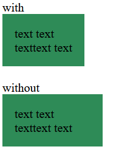

simple util to trim inline space from elements that have wrapping text inside of it

## usage

```sh
npm i hug-text
```

```js
import { hugText } from "hug-text";

const myElement = document.querySelector(".my-element");

hugText(myElement);
```
